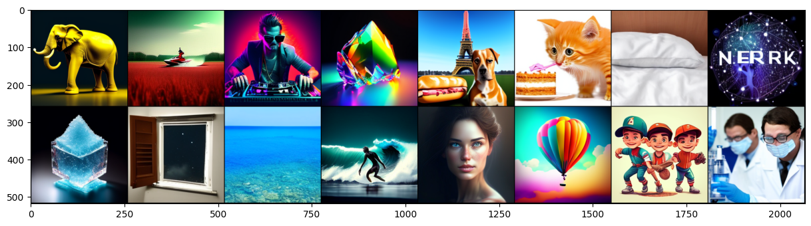
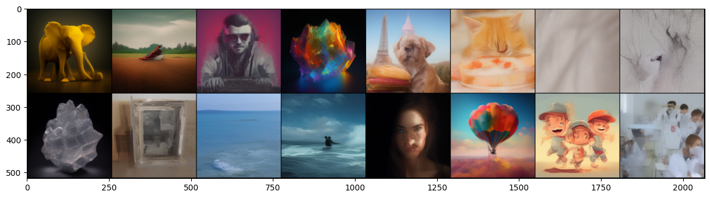
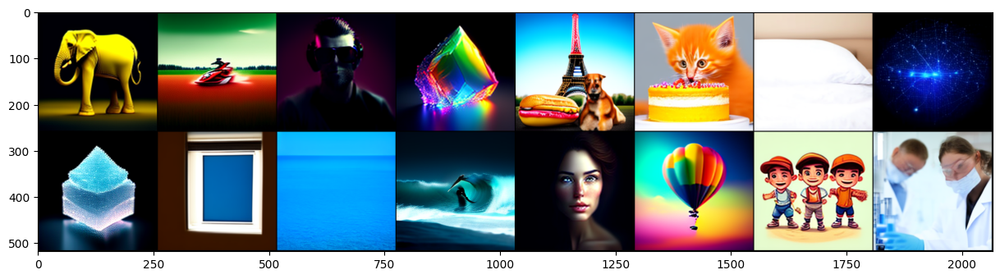
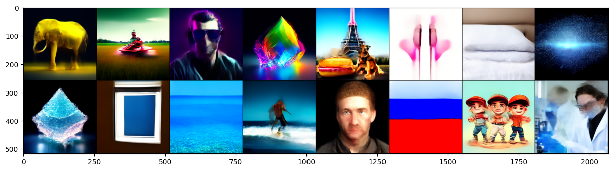
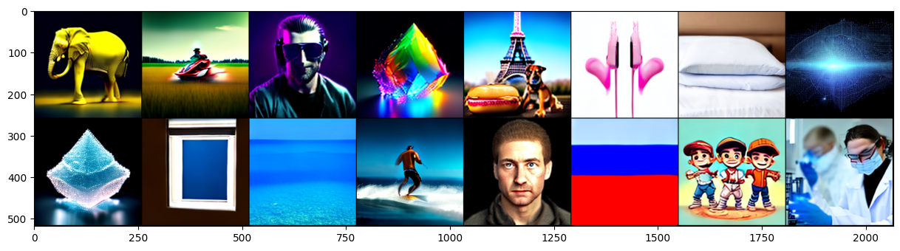
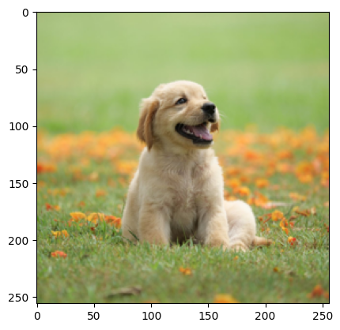
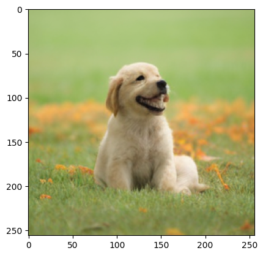
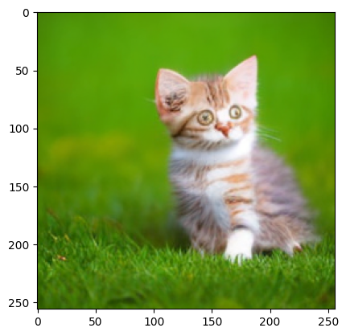

# InstructFlow
The aim of this repository is to test and implement Flow-Matching-based models

## text2img generation example
Rectflow $^1$ full steps

Rectflow $^1$ 5 steps

Rectflow $^2$ 5 steps

Rectflow $^2$ 1 step

Rectflow $^2$ + Distill 1 step

Rectflow $^2$ + Distill + Midpoint 1 step

## Inversion example
Input Image                                             |  FM Inversed                                                 |  Changed prompt
:------------------------------------------------------:|:------------------------------------------------------------:|:---------------------------------------:
 |   |  

# TODO:
- [x] [Train a foundint text2img model](sd_2_fm_finetuning.ipynb)
- [x] [FM Inversion](https://github.com/leffff/InstructFlow/blob/main/sd_2_fm_inversion.ipynb)
- [x] [Midpoint, Euler, RK4 solvers (with CFG)](https://github.com/leffff/InstructFlow/blob/main/instructflow/generation.py)
- [x] [N-th Reflow (for straightening and fast simulation)](https://github.com/leffff/InstructFlow/blob/main/sd_2_fm_finetuning_reflow_k_order.ipynb)
- [ ] Rectified Flow Distillation
- [ ] Lattent Adversarial Diffusion Distillaiton (4 steps)
- [ ] Train a model for jpeg restoration, debluring, denoising, superres, coloring
- [ ] Train a model for inpainting, outpainting
- [ ] RLHF
- [ ] Bridge Matching
