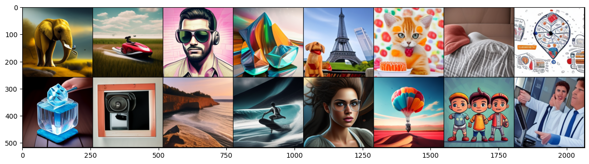

# Flow Models
The aim of this repository is to test and implement Flow-Matching-based models

# Warning
The data as well as dataset can not be shared!

## text2img generation example
Rectflow $^1$ full steps

Rectflow $^1$ 5 steps

Rectflow $^1$ 1 step

Rectflow $^2$ 5 steps

Rectflow $^2$ 1 step

Rectflow $^2$ + Distill 1 step

Rectflow $^2$ + Distill + Midpoint 1 step

LADD 4 steps

Shortcut 4 steps

## Inversion example
Input Image                                             |  FM Inversed                                                 |  Changed prompt
:------------------------------------------------------:|:------------------------------------------------------------:|:---------------------------------------:
 |   |  

# TODO:
- [x] [Train a foundint text2img model](sd_2_fm_finetuning.ipynb)
- [x] [FM Inversion](https://github.com/leffff/InstructFlow/blob/main/sd_2_fm_inversion.ipynb)
- [x] [Midpoint, Euler, RK4 solvers (with CFG)](https://github.com/leffff/InstructFlow/blob/main/instructflow/generation.py)
- [x] [N-th Reflow (for straightening and fast simulation)](https://github.com/leffff/InstructFlow/blob/main/sd_2_fm_finetuning_reflow_k.ipynb) (Same as Knowledge Distillaiton for Diffusion)
- [x] [Rectified Flow Distillation (1 step)](https://github.com/leffff/InstructFlow/blob/main/sd_2_fm_finetuning_reflow_distil_k.py)
- [x] [Immiscible Diffusion](https://github.com/leffff/FlowModels/blob/main/sd_2_fm_finetuning_immiscible.ipynb)
- [x] [Lattent Adversarial Diffusion Distillaiton](https://github.com/leffff/FlowModels/blob/main/sd_2_fm_finetuning_ladd.ipynb)
- [x] [Shortcut Model](https://github.com/leffff/FlowModels/blob/main/sd_2_fm_finetuning_shortcut.ipynb)
- [ ] Diffusion RLHF
- [ ] Bridge Matching
